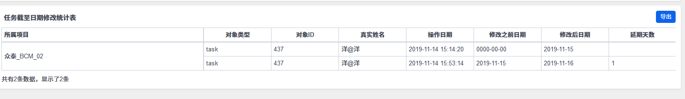

## **查询任务截至日期修改的时间及延期的天数**

```sql
select t3.`name` as 所属项目,t2.`objectType` as 对象类型,t2.`objectID` as 对象ID,t4.`realname` as 操作者,t2.`date` as 操作日期,t1.`old` as 修改之前日期,t1.`new` as 修改后日期,TIMESTAMPDIFF(DAY,t1.`old`,t1.`new`) as 延期天数 from `zt_history` as t1 left join `zt_action` as t2 on t1.action = t2.id  left join zt_project  t3 on t2.project = t3.id  left join zt_user as t4 on t2.`actor` = t4.`account` where `field` = 'deadline' and IF($project = '','1=1',t2.project = $project) and IF($actionbegin = '','1=1',t2.`date` > $actionbegin) and IF($actionend = '','1=1',t2.`date` < $actionend);
```



http://shiyangyang.5upm.com/report-show-99-project.html  shiyangyang syy123456

