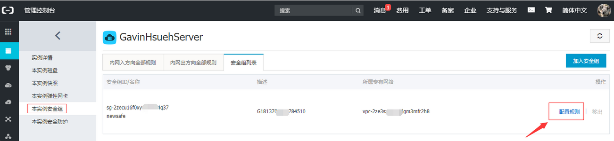
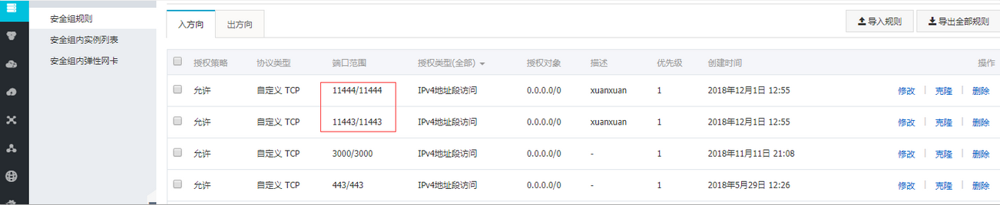

常用配置文件

```
数据库文件 
	windows：xampp/xxb/config/my.php 
	Linux：xxd/config/my.conf 
xxd配置文件 
	windows：xampp/xxd/config/xxd.conf 
	linux：/opt/zbox/run/xxd/config/xxd.conf 
下载客户端文件夹
	xxb/www/data/client/2.5.5 
```


https证书，喧喧的xxd有证书文件，可以在xxd的配置文件开启相应的配置。


手机App3.0.0 版本，已经添加消息撤回功能


通知模块文档：http://www.zentao.net/book/zentaopmshelp/301.html


```
部分代码开放，不再开源
很多人拿喧喧源码 修改成自己的名称 然后卖了 国内太多人对版权不够尊重。
喧喧目前不对外开放源码了，后面会整理一个开放源代码列表，列出哪些模块是开源的，哪些模块可以购买源码。
```


中间的消息处理是用go来转发的，后端是标准的http协议。


```
文件在手机端跳转到浏览器端无法下载，展示空白页面
1.网络是否有代理？浏览器的网络可以直接访问传输的文件的链接吗？
2.尝试修改 XXD 的配置项，关闭 https 功能试试。开启 https 如果没有合适的证书，会导致无法在其他浏览器访问下载地址。
3.修改配置之后，需要重启 xxd 服务器。
```


xxb客户端更新 https://xuan.im/book/xuanxuankehuduan/184.html 可以参考下


xxb喧喧性能和稳定性的朋友，可以看群文件里面的压测报告。


修改密码报错 `跳错Status code is 401.` 把密码中的特殊字符去掉试试。


文件上传大小限制：修改下xxd.conf配置文件中上传文件的限制。


喧喧开发者手册：https://xuan.im/book/dev/128.html


```
Linux系统防火墙开启喧喧端口
通过配置文件我们看到，部署喧喧XXD服务，服务器须开启11443和11444端口。
1.检查服务器是否开启了防火墙：service iptables status
2.若开启了防火墙，编辑防火墙配置文件，加入下面两行以开启11443和11444端口
vi /etc/sysconfig/iptables
-A INPUT -m state –state NEW -m tcp -p tcp –dport 11443 -j ACCEPT
-A INPUT -m state –state NEW -m tcp -p tcp –dport 11444 -j ACCEPT
3.重启防火墙：service iptables restart
4.查看端口是否成功开启：
netstat -anp | grep 11443
netstat -anp | grep 11444
```


```
开启喧喧端口
windows参考下面流程开启相应端口。
1. 控制面板中选择windows防火墙；
2. 点击左侧的“高级设置”选项；
3. 设置入站规则，点击“新建规则”，点选“端口”，单击 “下一步”；
4. 选择相应的协议，如添加11443端口，我们选择TCP，在我写本地端口处输入11443；
5. 允许连接，点击下一步；
6. 勾选“域”，“专用”，“公司”，点击“下一步”；
7. 输入端口名称，点“完成”即可。
```


阿里云ECS服务器安全组策略

如果服务器使用的是阿里云ECS，需要注意查看服务器所属安全组策略中是否开启了喧喧相应端口。



