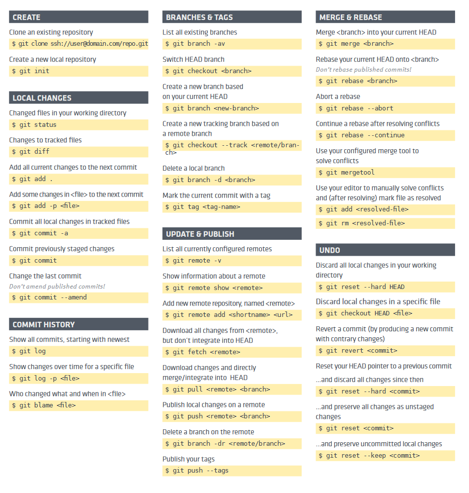

> 参考文档：https://www.liaoxuefeng.com/wiki/896043488029600
#### 常用命令合集

```git
mkdir mygit
cd mygit
git config --global user.name "Your Name"
git config --global user.email "email@example.com"
git init  # 初始化git仓库
touch test.txt

git add test.txt  # 工作区文件添加到缓存区        git add .   # 提交目录下的所有文件
git commit -m "message"  # 缓存区文件添加到分支仓库
git status  # 对比 分支仓库 与 工作区 下文件的区别，如果git status告诉你有文件被修改过，用git diff可以查看修改内容
git diff # 查看修改内容 工作区 与 缓存区的文件内容对比
git diff --cached  # 查看缓存区与分支仓库之间的内容差异

git log # 查看git历史信息，如果嫌输出信息太多，看得眼花缭乱的，可以试试加上--pretty=oneline参数
git reset --hard 版本id  # 回退某个版本，这里的版本是git log 查看出来的
git reflog # 查看过去的命令记录


git restore -- file  # 也可写为：git checkout -- test.txt 撤销丢弃工作区修改，文件没有提交到缓存区，参照分支仓库还原，已提交到缓存区又修改，参照缓存区修改。
git reset HEAD <file>  # 将缓存区的文件修改撤销，放回工作区。

git rm <filename>  # 删除版本库的文件，相当于 rm 文件，再git add 文件

<><><><><><><><><><><><><><><><><><><><>
<><><><><><> github远程仓库 <><><><><><>
<><><><><><><><><><><><><><><><><><><><>
第1步：创建SSH Key。在用户主目录下，看看有没有.ssh目录，如果有，再看看这个目录下有没有id_rsa和id_rsa.pub这两个文件，如果已经有了，可直接跳到下一步。
如果没有，打开Shell（Windows下打开Git Bash），创建SSH Key：  ssh-keygen -t rsa -C "youremail@example.com" 
你需要把邮件地址换成你自己的邮件地址，然后一路回车，使用默认值即可，由于这个Key也不是用于军事目的，所以也无需设置密码。
如果一切顺利的话，可以在用户主目录里找到.ssh目录，里面有id_rsa和id_rsa.pub两个文件，这两个就是SSH Key的秘钥对，id_rsa是私钥，不能泄露出去，id_rsa.pub是公钥，可以放心地告诉任何人。

第2步：登陆GitHub，打开“Account settings”，“SSH Keys”页面：然后，点“Add SSH Key”，填上任意Title，在Key文本框里粘贴id_rsa.pub文件的内容
这样您的电脑就可以向github远程仓库推送数据了.

第3步: 登陆GitHub，然后，在右上角找到“Create a new repo”按钮，创建一个新的仓库, 在Repository name填入项目名，其他保持默认设置，点击“Create repository”按钮，就成功地创建了一个新的Git仓库
第4步: 把本地仓库的内容推送到GitHub仓库, 根据GitHub的提示，在本地的learngit仓库下运行命令:
git remote add origin git@github.com:yandamin/learngit.git
远程库的名字就是origin，这是Git默认的叫法，也可以改成别的，但是origin这个名字一看就知道是远程库


```


#### 问题

```
》》》》》 warning: LF will be replaced by CRLF in ******（具体的一个文件）《《《《《

原因:
LF和CRLF其实都是换行符，但是不同的是，LF是linux和Unix系统的换行符，CRLF是window 系统的换行符。这就给跨平台的协作的项目带来了问题，保存文件到底是使用哪个标准呢？ git为了解决这个问题，提供了一个”换行符自动转换“的功能，并且这个功能是默认处于”自动模式“即开启状态的。
这个换行符自动转换会把自动把你代码里 与你当前操作系统不相同的换行的方式 转换成当前系统的换行方式（即LF和CRLF 之间的转换），这样一来，当你提交代码的时候，即使你没有修改过某个文件，也被git认为你修改过了，从而提示"LF will be replaced by CRLF in *****"
解决:
最简单的一种办法就是把自动转换功能关掉即可。
输入命令 ：git config core.autocrlf false (仅对当前git仓库有效）
git config --global core.autocrlf false (全局有效）
然后重新提交代码即可。


》》》》》 git 中文文件名 乱码 mac 《《《《《

git 默认中文文件名是 \xxx\xxx 等八进制形式
是因为 对0x80以上的字符进行quote
只需要　　git config --global core.quotepath false
core.quotepath设为false的话，就不会对0x80以上的字符进行quote。中文显示正常
```


