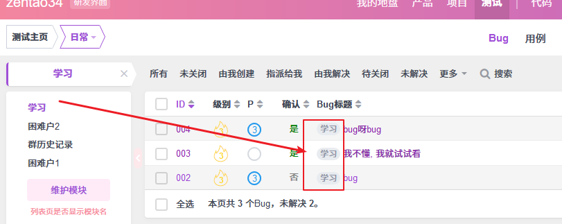
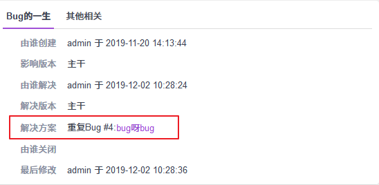

| Q                                                            | A                                                            |
| ------------------------------------------------------------ | ------------------------------------------------------------ |
| 关闭问题的时候不能添加附件，无法上传回归测试的记录。         | 目前关闭的时候无法添加附件, 可以将回归测试的记录以截图的形式上传下 ; 或者在点击编辑 , 上传下附件,再关闭 |
| 只能统计出各个模块的BUG数量，无法查看各个模块具体有哪些BUG。 |  可以在bug模块这里 点击模块看下 |
| 重复的BUG之间没有关联，查看的时候无法知道具体跟哪个BUG重复。 |  解决方案选择重复bug , 填写编号可以 在详情页面看到关联的bug |
| 立项信息不全：项目发起人、项目参与者、需求分析、项目参与部门、项目审批者等。 而且建立子任务时选择任务由谁完成由谁取消不成立，点击保存总提示这两项必须为空 | 1. [项目发起人、项目参与者、需求分析、项目参与部门、项目审批者]       目前企业版有自定义工作流,可以追加字段   , 可以了解下: http://www.zentao.net/book/zentaobizhelp/348.html 2. 没明白 , 可以截图看下吗 |
| 一个项目整体看起来的信息散乱。没有一个整体直观性，需要点击不同版块才能获取到各部份项目信息。 |  在项目标签下可以看到所有与此项目相关的信息 , 而且是按照日常使用的优先级排序的  .  熟悉了找起来也是很方便的 |
| 当一项任务取消需要在备注添加原因，原因查看方式不清晰，也可理解为不具备直观性。 | 目前取消的任务原因需要在任务详情  - 历史中 看下              |
| 缺少提醒此功能、完成进度未能数据化，对于一个项目整体进度的把握度不够。 | 项目整体进度 建议参照燃尽图, 这里是按照剩余任务的预计工时跟踪项目进度的,  维护好任务工时记录即可 |
| 需求跟模块不是一对一关系时，无法对需求进行划分多模块         | 模块与需求是一对多关系,  如果一个需求在多个模块下,  建议将需求创建在根模块下 |
| 任务可以分解成子任务，但子任务无法继续分解。                 | 目前仅支持1级的子任务,  建议细化任务粒度                     |
| 任务完成时，可以直接指派给自己，进而自行关闭该任务，没有经过上司审核认可。 BUG解决时，可以直接指派给自己，进而自行关闭该BUG，没有经过上司审核认可。 | 1. 任务 bug 完成默认指派的是 任务 bug的创建者,  用于创建者检查的,  因为存在任务是项目成员自己创建  或者任务检查者变化的情况 , 所以这里没有的指派没有限制 2. 或者 组织权限 收回用户关闭 bug 任务的权限 , 收回后账号重新登陆权限生效 . |
| 任务完成消息、关闭消息、指派消息等均不能实时推送给个人。只有完成消息在页面打开状态时才可看到。 | 1. 禅道有消息提醒功能 以邮件发送为例:  1. 后台-通知-邮件 看下smtp发信是否正常?  2. 禅道不会给当前操作者发信，因为当前的操作自己都清楚的，如果再发邮件，会造成过多的重复邮件。 3. 该用户必须设置了邮箱才能发信。 |
| 已完成或已关闭的任务，无法重新激活。                         | 权限问题 , 组织 -  权限  ,  添加下任务激活权限 ,  账号重新登陆权限生效 . |
| 临时任务导致其他已安排任务延迟，是否直接延长工时即可？谁来操作？ | [直接延长工时]  是指 修改的是任务截至日期吗? , 这个日期是用于提醒用户任务超时 与 截止日期到期前3天开始进行通知 使用的 .  此字段数据很重要吗?  可以由任务的执行者自己安排下即可 |
| 所有任务是否都需要关联上需求？                               | 不需要,  例如项目发布的任务 , 项目运维的任务等 |

